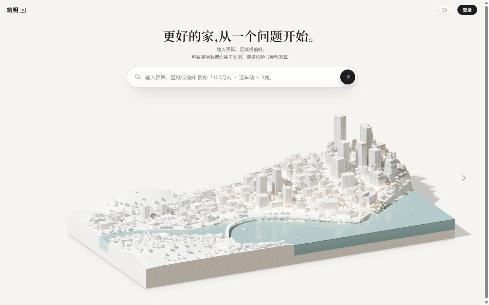
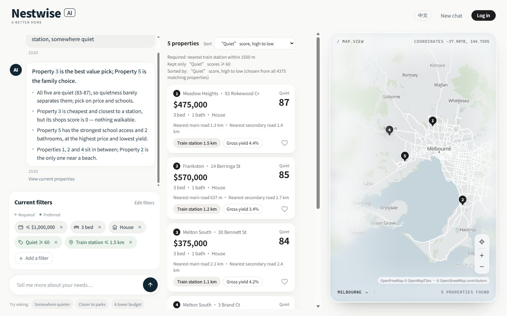

# Nestwise (筑明AI) — AI Melbourne Property Assistant

CSIT998 capstone project. Ask for a home in plain English or Chinese —
*"3-bedroom house under $1M near a train station, somewhere quiet"* — and Nestwise
searches 20,800 real Melbourne sales records, explains its choices, values each property
with a trained model, and works out stamp duty, rental yield and ROI.

**The core idea:** every number on screen says where it came from. Each figure is
one of three kinds, and the wording and styling keep them apart:

| Kind | Examples | How it is shown |
|---|---|---|
| **Measured / statutory** | sale price, distances, Victorian stamp duty (Duties Act 2000 s 28) | plain |
| **Assumption-based** | NOI, cap rate, ROI (they depend on an editable operating-cost rate) | marked as an assumption, editable in place |
| **Model-predicted** | estimated value and its 80% range | marked as a model estimate |

The LLM never invents listings or numbers. It turns your sentence into filters and
writes the explanation. All the data and every calculation come from the database and
plain Python formulas. If nothing matches, that path skips the LLM entirely.

➡️ **Full feature list:** [`docs/en/FEATURES.md`](docs/en/FEATURES.md)

| Homepage | Results, filters and map |
|---|---|
|  |  |

---

## Quick start (about 15 minutes, mostly downloads)

### 0. Prerequisites

| Tool | Version | Notes |
|---|---|---|
| **Python** | 3.12 – 3.14 | Windows: tick *"Add Python to PATH"* when installing |
| **Docker Desktop** | any recent | runs the Postgres + pgvector database |
| **Git** | any | or use GitHub's *Code → Download ZIP* |
| **An LLM API key** | — | DeepSeek, OpenAI, Qwen, OpenRouter… or a free local model via Ollama. See [Configuration](docs/en/CONFIGURATION.md) |

You need about 3 GB of free disk space (Python packages, the embedding model and the database).

### 1. Get the code

```bash
git clone https://github.com/michaelzhukn-beep/Capstone-Project-CSIT998.git
cd Capstone-Project-CSIT998
```

### 2. Install the Python packages

```bash
python -m venv .venv
# Windows:            .venv\Scripts\activate
# macOS / Linux:      source .venv/bin/activate
pip install -r requirements.txt
```

### 3. Configure your LLM key

```bash
# Windows:  copy .env.example .env
# macOS/Linux:  cp .env.example .env
```

Open `.env` and paste your key into `LLM_API_KEY=`. The file defaults to DeepSeek.
To use another provider, uncomment its block instead. Switching provider only means
editing `.env`; no code changes. See **[docs/en/CONFIGURATION.md](docs/en/CONFIGURATION.md)**.

### 4. Start the database and load the data

Start **Docker Desktop** first, then:

```bash
docker compose -f db/docker-compose.yml up -d
python db/setup_db.py
```

`setup_db.py` restores all 20,800 properties, with their search embeddings, from
`db/seed/properties.dump` in about a minute. You don't need a Kaggle download or the data
pipeline. It is safe to run again.

### 5. Run it

```bash
python serve.py
```

The first start downloads the embedding model (~550 MB, once) and loads the valuation model
and geographic data (~20 s). The browser then opens at **http://localhost:8000**.

On Windows you can just double-click **`start-web.bat`**.

```bash
python serve.py --port=8010    # different port
python serve.py --lan          # also reachable from phones on the same Wi-Fi
python serve.py --no-open      # don't open a browser
python run.py                  # command-line version (same engine)
python share.py                # public link via Cloudflare Quick Tunnel (needs cloudflared)
```

### 6. Check everything works (optional)

```bash
python tests/test_formulas.py     # no database or LLM needed
python tests/test_api.py          # needs the database; no LLM calls
```

See [docs/en/DEVELOPMENT.md](docs/en/DEVELOPMENT.md#tests) for the full test list.

---

## Documentation

| Read this | For |
|---|---|
| [`docs/en/FEATURES.md`](docs/en/FEATURES.md) | Everything the app can do, screen by screen |
| [`docs/en/CONFIGURATION.md`](docs/en/CONFIGURATION.md) | Switching the LLM provider / key, all `.env` settings, assumptions |
| [`docs/en/DEVELOPMENT.md`](docs/en/DEVELOPMENT.md) | Project layout, how a request flows, HTTP API, tests, rebuilding the data |
| [`docs/en/TROUBLESHOOTING.md`](docs/en/TROUBLESHOOTING.md) | Common setup problems and fixes |
| [`AGENTS.md`](AGENTS.md) | Rules for anyone (human or AI agent) changing the code |
| `docs/*.md` (Chinese) | Project state, architecture, design decisions; the team's engineering record |
| `NOTES_FOR_SUPERVISOR.md` (Chinese) | Long-form rationale, measurements and dead ends |
| [`Member B's tasks.md`](Member%20B's%20tasks.md) | How the dataset was sourced and cleaned |

## Tech stack

Python · FastAPI · LangGraph · PostgreSQL 16 + pgvector · sentence-transformers
(`nomic-embed-text-v1.5`) · XGBoost · Shapely · vanilla JS frontend (no build step) ·
Leaflet + MapLibre GL · three.js (homepage scene, baked in Blender/Cycles).

## Data sources and licences

| Data | Source | Licence |
|---|---|---|
| Property sales 2016–2018 | [Melbourne Housing Market, Kaggle (Tony Pino)](https://www.kaggle.com/datasets/anthonypino/melbourne-housing-market) | CC BY-NC-SA 4.0 |
| Rents | DFFH Rental Report, moving annual rent by suburb | CC BY 4.0 |
| Amenities, roads, rail, land use | © OpenStreetMap contributors | ODbL |
| Planning zones and overlays | Vicmap Planning (DataVic) | CC BY 4.0 |
| School catchment zones | Victorian Department of Education (DataVic) | CC BY 4.0 |
| Crime rates by LGA | Crime Statistics Agency Victoria | CC BY 4.0 |
| Map tiles | OpenFreeMap / OpenMapTiles (fallback: OpenStreetMap tiles) | ODbL |
| Stamp duty | *Duties Act 2000* (Vic) s 28(1) | legislation |

`db/seed/properties.dump` is derived from the Kaggle dataset and shared under the
same CC BY-NC-SA 4.0 terms: non-commercial use, with attribution.

## Known limitations

- **Distances are straight-line.** There is no road network, so walking or driving times are reported as unsupported.
- **Sales data is from 2016–2018**, and stamp duty uses the rate table in force then.
- Operating costs are an **assumption** (default 28% of rent); every result built on them is labelled as such.
- Conversations live in memory and are lost when the server restarts. The investment
  assumptions are shared by everyone using the same server.
- The 3D homepage scene needs WebGL and a screen at least 900px wide. Otherwise it falls back to an illustrated city.

Current open issues are tracked in `docs/PROJECT_STATE.md` (*Known Issues*) and `docs/TODO.md`.
